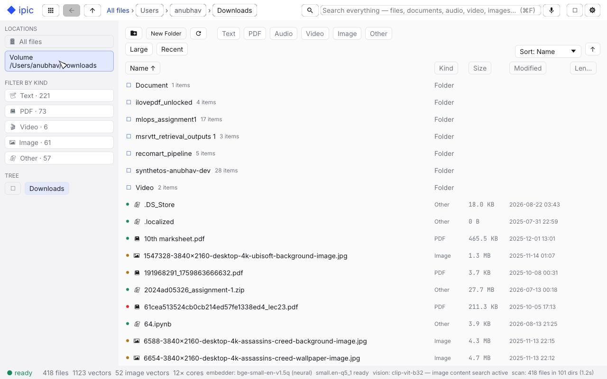
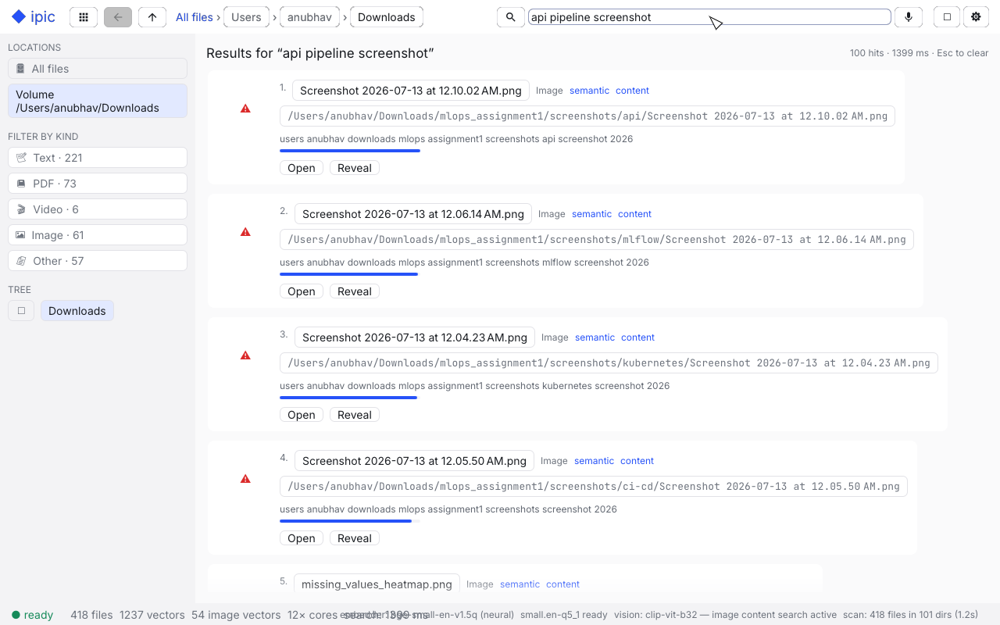

# ipic

A lightweight, blazingly fast multimodal file manager with **fully on-device RAG search**.
Type or *speak* a natural-language query and ipic finds it across your text files, PDFs,
images, audio recordings and videos — no cloud, no API calls, no telemetry.

| | |
|---|---|
|  |  |

```
◆ ipic     Browse ‹ › ↑  documents › notes                Ask | ◧ | ⚙
┌────────────┬──────────────────────────────────────────┬─────────────┐
│ Locations  │  Filter by name…   Name ↑ Size Modified   │  preview    │
│ All files  │  📝 quarterly-roadmap.md   indexed        │  metadata   │
│ Filter     │  🖼 beach-sunset.jpg  content · indexed   │  thumbnail  │
│ Tree       │  🎧 lecture.mp3            06:57 indexed   │  transcript │
├────────────┴──────────────────────────────────────────┴─────────────┤
│ ● indexing 1.2k left · 88/s · ≈ 14m   ▮▮▮▮▮░░░░                        │
└─────────────────────────────────────────────────────────────────────┘
```

## What it does

- **Standard file manager** — tree navigation, breadcrumbs, back/forward/up,
  metadata filtering (kind, name, size, recency), column sorting, virtualized
  table for huge directories, open/reveal/rename/trash, multi-select.
- **Unified multimodal search** — one query box, no mode picking: text files,
  PDFs, images, audio and video are ranked together. Hybrid retrieval fuses
  four lanes — dense **semantic** vectors (bge-small-en-v1.5 via ONNX),
  **vision** vectors (CLIP: query text and image pixels share one latent
  space), **BM25 keyword** (SQLite FTS5), and **filename** match — merged with
  weighted reciprocal rank fusion. Typical latency: ~30 ms with models
  resident (most of it embedding the query; the vector scan is sub-ms).
- **Content-based image search** — every image is decoded, downsampled to CLIP
  input and embedded by pixel content. "sunset over water" finds your beach
  photographs with no filename hints. HEIC/HEIF/AVIF decode through ffmpeg
  when present; svg falls back to filename context.
- **Spoken queries** — record from the microphone; whisper (small.en, q5,
  beam-search decoding) transcribes locally. Queries are answered by BOTH the
  transcript's hybrid lanes AND direct audio-to-audio matching against indexed
  recordings (acoustic fingerprints: FFT spectral-shape + flux vectors).
- **Audio/video understanding** — speech in audio and video files is transcribed
  at index time (ffmpeg decode → whisper), so lectures, podcasts and talks
  become full-text + semantically searchable.
- **Decentralized index** — one shard per root: each has its own SQLite
  catalog, FTS5 index and three quantized vector stores. Roots scan, write and
  serve queries in parallel; removing a root never touches the others.
- **Fully background lifecycle** — a persistent filesystem watcher indexes new
  files, re-embeds modified ones and frees the vectors of deleted ones, all
  while the UI stays responsive. The footer shows live progress, throughput
  and a per-kind ETA (an hour of audio is not a second of JPEG).
- **Everything else** (archives, binaries…) is catalogued with metadata,
  filterable and sortable — just not RAG-indexed.

## Design goals (and how they're met)

| Goal | Approach |
| --- | --- |
| Blazing fast | Parallel directory walker, per-root shards writing concurrently, mmap'd i8-quantized vector stores scanned with rayon + integer dot products |
| Minimum RAM | Vectors stored as 1-byte-per-component (4× smaller than f32), scanned through the page cache; decode memory bounded by thumbnail-time downscale |
| Saturate the machine | `[compute]` config caps/derives threads per stage — scan, extraction workers, ONNX intra-op, search — defaults use every core; idle hardware is waste |
| On-device only | bge-small (~130 MB) + CLIP ViT-B/32 towers (~150 MB) + whisper small.en q5 (~181 MB), all cached under `~/.ipic/`; hashing fallback keeps search alive offline |
| Modern CPUs | NEON/Accelerate BLAS for whisper, ONNX intra-op threading for embeddings, self-serving worker pool |
| Swap-friendly UI | The GUI is a thin shell over `ipic-rag`'s `Engine` facade — replaceable without touching core logic |

### Why a custom vector store (not usearch/LanceDB)

A 1 TB disk yields at most ~5 M vectors across all modalities (worst-case ~2 GB
quantized + mmap'd). An exact rayon-sharded i8 scan of that runs in tens of
milliseconds on every core: exact recall, zero index-build cost on first run,
and delete/update churn is free — the exact properties a file index needs.
HNSW (usearch) wins past ~10 M vectors or on single-core-constrained devices,
but pays graph-build time during first-run indexing and degrades under
constant file churn. The `VectorStore` API is the swap seam if that crossover
is ever reached; measured query latency lives in the
section below.

## Architecture

```
                        ┌──────────────────────────── Engine (supervisor) ───────────────────────────┐
                        │  shared models: bge-small (text) · CLIP ViT-B/32 (vision) · whisper (ASR) │
                        │  [compute] budget · progress/ETA · persistent fs watcher                  │
                        └───┬──────────────┬──────────────┬──────────────┬──────────────┬───────────┘
                            ▼              ▼              ▼              ▼              ▼
                     ┌──────────┐   ┌──────────┐   ┌──────────┐   ┌──────────┐   ┌──────────┐
   ~/Downloads  ───▶ │  shard   │   │  shard   │   │  shard   │   │  shard   │   │  shard   │
   ~/Documents  ───▶ │ catalog  │   │ catalog  │   │ catalog  │   │ catalog  │   │ catalog  │
   ~/Pictures   ───▶ │ .db WAL  │   │          │   │          │   │          │   │          │
   …per root        │ +FTS5    │   │          │   │          │   │          │   │          │
                     │ text 384d│   │          │   │          │   │          │   │          │
                     │ img 512d │   │          │   │          │   │          │   │          │
                     │ aud 128d │   │          │   │          │   │          │   │          │
                     └──────────┘   └──────────┘   └──────────┘   └──────────┘   └──────────┘
```

One shard per root, each a self-contained index (SQLite + three quantized vector
stores) that scans, writes and serves queries on its own; the engine fans
searches out across shards on rayon and fuses the lanes:

| Lane | Source | Weight | Latency at 10⁵ files |
|---|---|---|---|
| semantic | bge-small-en-v1.5 int8 → i8 mmap dot scan | 1.0 | single-digit ms |
| content (vision) | CLIP text tower ↔ image pixel vectors | 0.9 | single-digit ms |
| keyword | SQLite FTS5 BM25 | 0.7 | single-digit ms |
| filename | catalog LIKE | 0.5 | single-digit ms |
| acoustic (spoken queries) | FFT spectral fingerprint ↔ audio store | 0.9 | ~1 ms |

Fusion: weighted reciprocal rank (Σ w/(60+rank)) over globally assigned ranks.

**Indexing pipeline** (background, crash-safe, resumable): per-root parallel
walk → 1024-row batched upserts → self-serving workers claim jobs across
shards in batches (round-robin text/image lanes, whisper-gated media) →
parallel decode/extraction → batched single-instance inference → FTS5 rows +
quantized vectors → Done. A modify resets the file to Pending after freeing
its old vectors; a delete frees rows, chunks and every embedding; unchanged
files are never re-embedded.

```
crates/
├── ipic-core   parallel walker · SQLite catalog (files/dirs/FTS5/file_vectors) ·
│               debounced watcher · compute budget · config
├── ipic-rag    shards (one per root) · text embedder + CLIP vision towers ·
│               mmap i8 vector stores (text 384-d · vision 512-d · audio 128-d) ·
│               chunker · text/PDF/image/audio extraction · whisper transcriber ·
│               cross-shard hybrid search (RRF) · progress/ETA · Engine
├── ipic-cli    headless driver: scan · search · ask --audio · status · list · config
└── ipic-app    egui GUI: browse table, unified search + mic, thumbnails, details, settings
```

**Data layout** — `~/.ipic/`:

```
config.toml
models/                     bge · clip text+vision · whisper (shared, downloaded once)
shards/<root>-<hash>/       catalog.db · vectors.bin · image-vectors/ · audio-fingerprints/
```

## Requirements

- **Rust** 1.94+ (`rustup`), and `cmake` (builds whisper.cpp automatically)
- **macOS** on Apple Silicon is the primary target (NEON/Accelerate, Metal optional);
  Linux works with the same code paths
- **ffmpeg** (optional) — broadens audio/video decode and adds HEIC/HEIF/AVIF
  images; wav/mp3/flac/ogg/m4a and jpg/png/webp/gif/bmp/tiff work without it
- ~450 MB free disk for the local models (downloaded once, then fully offline)

## Getting started

```bash
cargo build --release

# GUI
./target/release/ipic

# or headless
./target/release/ipic-cli scan                # index everything under roots (live bar + ETA)
./target/release/ipic-cli search "radiation shielding on mars"
./target/release/ipic-cli search "sunset over water"   # image content lane
./target/release/ipic-cli ask --audio query.wav
./target/release/ipic-cli status
./target/release/ipic-cli config --set-roots ~/Documents ~/Pictures ~/Downloads
```

First run downloads the models into `~/.ipic/models/`; everything after that
is 100% offline. Default scope is `~/Downloads` — add or change roots any time
via settings or `config --set-roots` (each root becomes its own shard).

Configuration lives at `~/.ipic/config.toml`:

```toml
roots = ["/Users/you/Downloads"]
image_embedder = "clip-vit-b32"   # or "none" for filename-only images

[compute]        # 0 = derive from the machine (defaults saturate every core)
max_cores = 0
scan_threads = 0
extract_workers = 0
ort_threads = 0
search_threads = 0
```

## Notes & trade-offs

- Audio/video search covers **speech** via transcripts, plus **audio-to-audio**
  similarity through acoustic fingerprints. True semantic understanding of
  non-speech audio (music mood, ambience) remains future work.
- GPU (Metal) whisper is available (`whisper_use_gpu = true`): very fast, but
  transcriptions serialize on a single state — the default CPU path
  (Accelerate BLAS, ~35× realtime) parallelizes across workers.
- Removing a root unloads its shard but keeps its data on disk; re-adding the
  root resumes from the existing index.
- Images above `max_image_mb` (64 MB default) are skipped for pixel embedding
  (decode-memory guard) and stay searchable by filename context.

## Measured on the reference machine (M2 Pro, 12 cores)

Reference index: `~/Downloads` — 418 files (221 text · 73 PDF · 61 images ·
6 video · 57 other), indexed end-to-end by the v2 pipeline.

| Metric | Value |
| --- | --- |
| Text vectors | 1.5k chunks (bge-small, i8-quantized) incl. whisper transcripts |
| Image vectors | 53 / 61 images (CLIP ViT-B/32; HEIC needs ffmpeg, else filename context) |
| Search, cold process | 1.4 – 1.8 s end-to-end — model load dominates; first in-app query 0.4 s |
| Search, models resident | 26 – 32 ms measured (embedding the query on both towers is most of it; the vector scan itself is sub-millisecond at this shard size) |
| Scan discovery | ~2.5k files/s across parallel shards (350k-file home directory) |
| Tokenization | 3 ms per 64 chunks — parallel BPE is free; ONNX inference is the wall |
| Compute in use | 12 of 12 cores (scan 12 · extract 11 · ONNX 6 · search 12) |

Pipeline pathologies found and fixed while indexing at bulk scale: claim
queries re-sorting the pending set, huge upsert transactions starving worker
claims, a single read/write SQLite connection convoying, minified-code
"words" burning seconds per chunk in the tokenizer, unbounded queue backlog
(RSS ballooned to ~9 GB). All gone — `files_claim` index, batched claims,
dedicated read connection, chunk caps, bounded channels. First-run indexing
is dominated honestly by the models (whisper, CLIP); the footer/CLI bar
shows live per-kind ETA throughout, and subsequent launches are incremental.
Gigatoken was evaluated for tokenization and rejected: Python-only
distribution, no crates.io crate, no WordPiece/BERT support.

## Tests

```bash
cargo test --workspace   # 51 tests: unit + engine e2e (shards, watcher lifecycle,
                         # modify re-index/delete frees, cross-shard merge) + GUI automation
IPIC_VISION_TEST=1 cargo test -p ipic-rag --test integration vision_content
                          # real-CLIP content search on generated images
IPIC_SCREENSHOTS=1 UPDATE_SNAPSHOTS=1 cargo test -p ipic-app --test screenshots
                          # regenerate the screenshots above from the live index
```
